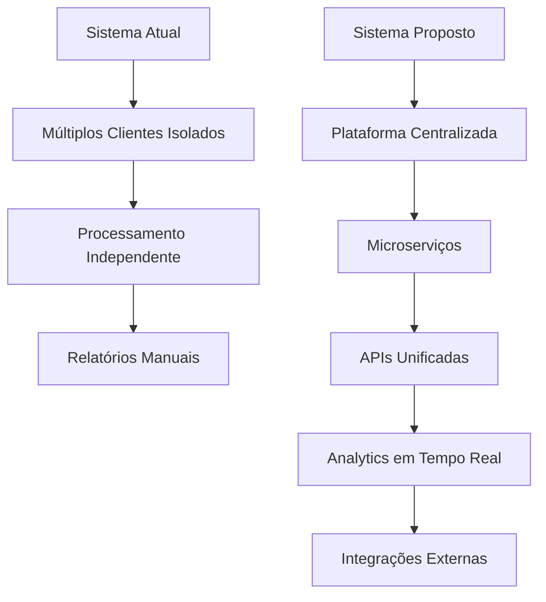

# Análise Estrutural e Plano de Melhorias - Documentações

## 1. Itens Inutilizados, Redundantes ou Obsoletos

### 1.1 Arquivos Duplicados Identificados
- **`backupServiceOtimizado.js`** e **`backupServiceOtimizado.ts`**: Versões idênticas do serviço de backup em JavaScript e TypeScript sem diferenças funcionais significativas. A versão TS oferece tipagem mas não justifica manutenção paralela.

- **`StateStorage.ts`** e **`StateStorage-fixed.ts`**: Duas versões das interfaces de armazenamento de estado. A versão "fixed" sugere correções, mas manter ambas indica falta de consolidação.

### 1.2 Funcionalidades Não Utilizadas
- **`googleAQ.ts`** (serviço "AQ"): Implementação incompleta que não utiliza IA Gemini, retornando apenas frases aleatórias estáticas. Funciona como fallback mas com limitações severas.

- **`openai.ts`**: Módulo mencionado no índice mas sem documentação específica, sugerindo implementação abandonada ou não utilizada.

### 1.3 Documentações Pendentes
- **23 arquivos sem documentação** (34.3% do total): Dentre eles, vários módulos de disparo, followup e relatórios que são críticos para o funcionamento do sistema.

## 2. Funcionalidades Não Utilizadas com Potencial

### 2.1 IA e Automação
- **Sistema de Agendamento (`sistemaLembretes.ts`)**: Módulo completo de lembretes automatizados para agendamentos, com potencial para notificações proativas e follow-up inteligente.

- **Análise de Conversa IA (`analiseConversaIA.ts`)**: Sistema robusto para análise de conversas usando IA, ideal para business intelligence e métricas avançadas.

- **Rate Limiting Avançado (`rateLimitManager.ts`)**: Controle inteligente de taxa com filas, perfeito para otimização de custos de API e performance.

### 2.2 Integrações Externas
- **Google Workspace Suite**: Múltiplos serviços (Sheets, Chat, Docs) parcialmente implementados, com potencial para automação completa de escritório.

- **CRM Integration (`crmDataService.ts`)**: Serviço abrangente de CRM com potencial para sincronização bidirecional e automação de vendas.

### 2.3 Monitoramento e Observabilidade
- **Sistema de Monitoramento (`monitoringService.ts`)**: Framework completo para observabilidade, subutilizado para análise de performance e alertas.

## 3. Pontos que Necessitam Melhorias Imediatas

### 3.1 Arquitetura e Organização
- **Falta de Padronização**: Mistura de JavaScript/TypeScript sem estratégia clara de migração.
- **Separação de Responsabilidades**: Alguns módulos fazem muitas coisas (ex: `index.ts` do cliente CMW).
- **Gerenciamento de Estado**: Duplicação de arquivos de storage indica problemas de arquitetura.

### 3.2 Qualidade de Código
- **Tratamento de Erros**: Muitos módulos mencionam "bugs conhecidos" mas sem correções implementadas.
- **Validação de Entrada**: Falta de sanitização consistente de dados de entrada.
- **Performance**: Processamento síncrono em operações que deveriam ser assíncronas.

### 3.4 Segurança
- **Gestão de Chaves API**: Múltiplas chaves Gemini sem rotação automática ou monitoramento de uso.
- **Validação de Dados**: Pouca proteção contra injeção de dados maliciosos via WhatsApp.

## 4. Sugestões de Aprimoramentos

### 4.1 Funcionais
- **Dashboard Centralizado**: Interface unificada para monitoramento de todos os clientes e métricas em tempo real.
- **Sistema de Templates**: Biblioteca de respostas padronizadas com personalização por cliente.
- **Analytics Avançado**: Relatórios preditivos usando dados históricos de conversas.
- **Integração Multi-plataforma**: Suporte além do WhatsApp (Telegram, Instagram, etc.).

### 4.2 Design e UX
- **Interface Web Moderna**: Substituir interfaces básicas por dashboards responsivos.
- **Sistema de Notificações**: Alertas inteligentes para leads qualificados e problemas.
- **Configuração Visual**: Editores drag-and-drop para fluxos de automação.

### 4.3 Integração
- **APIs RESTful**: Exposição de funcionalidades via API para integrações externas.
- **Webhooks**: Notificações em tempo real para sistemas externos.
- **Sincronização Bidirecional**: Atualização automática entre CRM, Google Sheets e sistema interno.

## 5. Novas Funções Inovadoras

### 5.1 Inteligência Artificial Avançada
- **Chatbot Multilingue**: Suporte automático para múltiplos idiomas usando IA.
- **Análise de Sentimentos**: Detecção automática de humor e tom das conversas para melhor atendimento.
- **Recomendações Personalizadas**: Sugestões de produtos/serviços baseadas no histórico do lead.

### 5.2 Automação de Vendas
- **Funil de Vendas Automatizado**: Sequências inteligentes de mensagens baseadas no estágio do lead.
- **Lead Scoring Dinâmico**: Pontuação em tempo real baseada em interações e comportamento.
- **Previsão de Conversão**: Machine learning para identificar leads com maior probabilidade de conversão.

### 5.3 Analytics e Business Intelligence
- **Relatórios Preditivos**: Previsões de vendas e comportamento baseado em dados históricos.
- **Segmentação Inteligente**: Agrupamento automático de leads por características similares.
- **Otimização de Campanhas**: A/B testing automático de mensagens e estratégias.

### 5.4 Recursos Avançados
- **Video Calls Integradas**: Agendamento e realização de videochamadas via WhatsApp Business API.
- **Pagamentos Integrados**: Processamento de pagamentos diretamente no chat.
- **Agendamento Inteligente**: Sugestões automáticas de horários baseadas na disponibilidade do cliente.

---

## Diagrama de Arquitetura Atual vs. Proposta

## Plano de Implementação Priorizado

### Fase 1: Consolidação (1-2 semanas)
1. Remover arquivos duplicados e escolher melhores versões
2. Padronizar JavaScript/TypeScript por módulo
3. Completar documentações críticas

### Fase 2: Otimização (2-3 semanas)
1. Implementar sistema de cache inteligente
2. Melhorar tratamento de erros e validação
3. Otimizar performance de processamento de mensagens

### Fase 3: Inovação (3-4 semanas)
1. Dashboard centralizado
2. Sistema de analytics avançado
3. Integrações com ferramentas externas

### Fase 4: Expansão (4-6 semanas)
1. Suporte multi-plataforma
2. Funcionalidades de IA avançada
3. Automação completa do funil de vendas